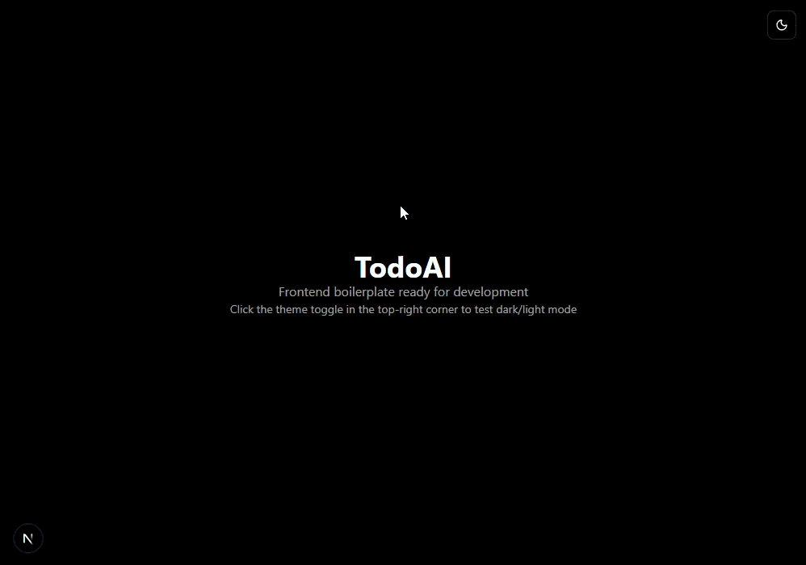

Today I got **Claude** to bootstrap the front-end. It set up a lot of utilities and some custom hooks along with the general setup needed for the packages I asked it to use.

It also set up a bunch of tests, but I'm not too hyped about them, I feel like there are a lot of them that may be redundant and are likely poorly designed, but today I didn't feel like reviewing much, so I just let it do its thing and as long as things built and worked, I was happy.

Now I have a full **NextJS** boiler plate with **Tailwind** and **ShadCN** components, with a working **theming** implementation and a **theme toggle** button. It feels like a good starting point for a project, although I feel the urge to do some cleaning on it and reorganizing things to my liking. I may have to start doing manual work tomorrow.

**For now, we have this:**
