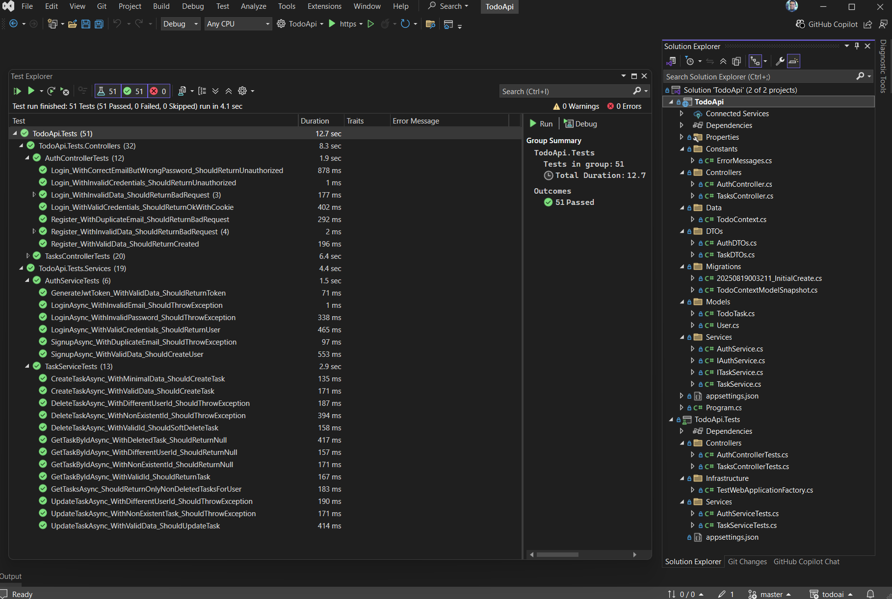
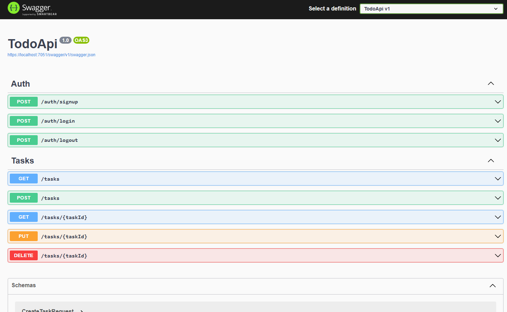

It has been a few days since I last worked on this. I've decided to change my approach and work on the back-end before getting into the weeds with designing the front-end.

Today, I started by asking **Claude** what was next on our task list. Claude proceeded to show me our tasks list and asked me what I wanted to start with, since we hadn't started any tasks yet (UI Design is not included on this task list).

As mentioned before, I decided to start with the backend since I just wanted to get something that I could try out soon and get my hands dirty. To my surprise, Claude was able to code the entire backend. I did have to do a good amount of hand-holding, but it's crazy to thing that **I have a functioning backend with a test suite of 51 unit and integration tests**.

At first, only 20 out of 42 tests passed, but after walking Claude through the debugging process and doing some digging myself, we got all 42 to pass and then added a few more for a new endpoint that was needed, thus getting to 51 passing tests. I also did manual testing with how I'd expect to use the API and it worked.

*Granted, this is a very simple To Do API but I'm still impressed with the results*. I do admit that I am not reviewing its code as deeply for this test project as I would on a serious project, so *maybe the gains in development speed will be paid in refactoring/debugging later on*. We'll see.

Now that the project is taking some shape I'll start actually using branches so I don't end-up accidentally nuking things.

**Here's a screenshot of the resulting back-end's project structure and the passing tests:**

**And here's the resulting swagger:**
